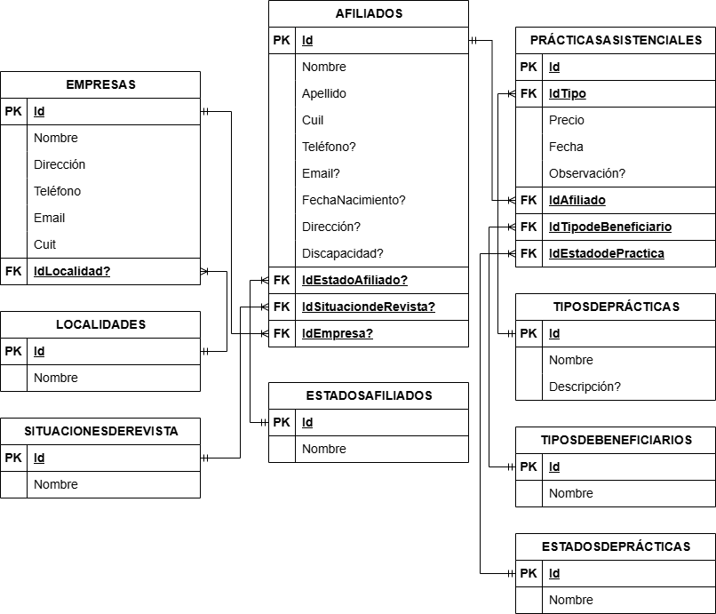

# pps_tup
# 📋 Proyecto: Sistema de Gestión de Prácticas Médicas para el Sindicato de la Madera

## 🎯 **Objetivo del Proyecto**
Crear una aplicación web en **ASP.NET Core MVC**, respaldada por una **API REST**, para gestionar prácticas médicas y datos de afiliados y sus familias de forma eficiente y segura.

---

## 🚀 **Funciones Principales**

### 1. **Base de Datos y API REST**
- **Base de Datos:** Diseñada en **SQL Server** con **9 modelos relacionados**.
- **API REST:** 
  - Funcionalidades CRUD para Afiliados, Empresas y Prácticas Asistenciales.
  - **Seguridad con Identity:** Tres usuarios preconfigurados:
    - **Administrador:** Acceso completo (CRUD).
    - **Manager:** Lectura y actualización.
    - **Usuario de Solo Lectura:** Solo visualización.

### 2. **Interfaces de Usuario**
- **MVC conectado a la API REST**:
  - Panel administrativo para gestionar afiliados, empresas y prácticas.
  - Búsqueda avanzada con filtros dinámicos.
  - Autenticación mediante credenciales predefinidas.

### 3. **Importación y Exportación de Datos**
- **Importación desde Excel:** Carga masiva de datos.
- **Exportación a Excel:** Respaldo y análisis.

### 4. **Pruebas y Documentación**
- Validación de las funcionalidades y flujos principales.
- Documentación técnica de la base de datos, endpoints y operaciones.

---

## 🛠 **Tecnologías Utilizadas**
- **Backend:** ASP.NET Core (API REST) con Entity Framework Core.
- **Base de Datos:** SQL Server.
- **Frontend:** ASP.NET Core MVC, Razor Pages, HTML5, CSS3, Bootstrap.
- **Archivos Excel:** EPPlus o ClosedXML.
- **Seguridad:** Identity para autenticación.

---

## 📅 **Duración del Proyecto**
- Tiempo estimado: **60 horas**  
- Modalidad: Proyecto de práctica supervisada.

---

